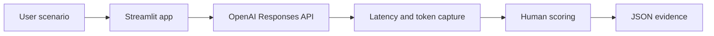

# AI Model Behavior Evaluation Lab

A hands-on Streamlit lab for comparing how prompt design changes AI model behavior, operational recommendations, latency, token usage, and human-assigned quality scores.

## Product problem

AI product teams need more than a working model call: they need repeatable evidence about whether prompts produce correct, risk-aware, actionable, and well-supported outputs. This prototype gives product managers and engineers a lightweight way to compare two prompt configurations against the same scenario and preserve the result as reviewable JSON evidence.

Model-behavior evaluation matters because small changes in role, scope, and requested evidence can materially change a model's recommendation. A side-by-side experiment makes those differences visible without treating model output as an objective verdict.

## Experiment design

The lab sends the same synthetic production-migration scenario to `gpt-5.6-luna` through the OpenAI Responses API. Each **Run evaluation** click makes two independent requests with low reasoning effort and a 700-output-token limit:

- **Configuration A — General Analysis:** asks a technical program manager to analyze the situation and recommend whether migration should be approved.
- **Configuration B — Operational Readiness Analysis:** explicitly asks about combined-workload performance, dependencies, rollback readiness, operational risk, missing evidence, and required mitigations.

The app captures each response, latency, and available input/output/total token counts. Results remain in Streamlit session state so scoring interactions and JSON downloads do not repeat API calls.

## Human-evaluation rubric

An evaluator assigns each response a score from 1 to 5 on four dimensions:

| Dimension | Evaluation question |
|---|---|
| Correctness | Is the conclusion sound given the available facts? |
| Risk awareness | Does the response identify material delivery and operational risks? |
| Actionability | Does it provide concrete next steps and mitigations? |
| Evidence quality | Does it ground claims in evidence and identify what is missing? |

These are human-assigned quality scores, not automated model scores.

## Workflow



## Run 001 results

| Prompt configuration | Latency | Total tokens | Human quality score |
|---|---:|---:|---:|
| Configuration A — General Analysis | 8.51 seconds | 358 | 18/20 |
| Configuration B — Operational Readiness Analysis | 4.17 seconds | 361 | 20/20 |

**Winner: Configuration B.** In this run, Configuration B produced the more operationally actionable response and was approximately 51% faster, while token usage was nearly identical. This is a single observation: one run is insufficient to conclude that Configuration B is consistently faster or better.

The exported evidence is stored at [`evaluations/model_behavior_evaluation_run_001.json`](evaluations/model_behavior_evaluation_run_001.json).

## Project structure

```text
.
├── app.py
├── evaluations/
│   └── model_behavior_evaluation_run_001.json
├── .env.example
├── .gitignore
├── LICENSE
├── README.md
└── requirements.txt
```

## Setup and run on Windows

Requirements: Python 3, Git, an OpenAI API account, and API billing enabled.

```powershell
git clone https://github.com/rajeshwarigorthi/ai-model-behavior-evaluation-lab.git
cd ai-model-behavior-evaluation-lab
py -3 -m venv .venv
.venv\Scripts\python.exe -m pip install -r requirements.txt
setx OPENAI_API_KEY "your-api-key-here"
```

Open a new PowerShell window after `setx`, return to the project directory, and start the app:

```powershell
.venv\Scripts\python.exe -m streamlit run app.py
```

Open the local URL printed by Streamlit, typically `http://localhost:8501`.

The app initializes `OpenAI()` without passing a key, so the official SDK reads `OPENAI_API_KEY` from the Windows environment. Never commit a real key or place one in `.env.example`. OpenAI API billing is separate from a ChatGPT subscription.

## Synthetic data and privacy

The included scenario is synthetic and is intended only to demonstrate an evaluation workflow. Do not enter protected health information, personally identifiable information, real company or customer information, credentials, or other confidential data.

## Limitations

- A single run cannot establish statistical significance or consistent superiority.
- Model output and latency can vary across requests and service conditions.
- Human scores reflect one evaluator and are not calibrated across reviewers.
- The prototype compares two prompts, one model, and one scenario at a time.
- Results persist only for the active Streamlit session unless downloaded.
- The lab does not include a database, authentication, user tracking, automated retry, or production monitoring.

## Next steps

- Run repeated trials for each prompt configuration.
- Evaluate multiple synthetic scenarios and risk profiles.
- Add calibrated human reviewers and optional automated graders.
- Capture per-run cost estimates alongside token usage.
- Compare distributions statistically rather than relying on a single result.
- Add reproducible experiment identifiers and structured rubric guidance.

## License

This project is available under the [MIT License](LICENSE).
