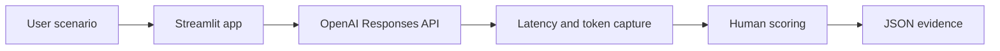

# AI Model Behavior Evaluation Lab

A hands-on Streamlit lab for comparing how prompt design changes AI model behavior, operational recommendations, latency, token usage, and human-assigned quality scores.

## Product problem

AI product teams need more than a working model call: they need repeatable evidence about whether prompts produce correct, risk-aware, actionable, and well-supported outputs. This prototype gives product managers and engineers a lightweight way to compare two prompt configurations against the same scenario and preserve the result as reviewable JSON evidence.

Model-behavior evaluation matters because small changes in role, scope, and requested evidence can materially change a model's recommendation. A side-by-side experiment makes those differences visible without treating model output as an objective verdict.

## Who this product is for

This is an internal evaluation tool, not a customer-facing chatbot. Its primary user is an AI Product Manager or AI product team deciding whether a proposed prompt change should be released. Configuration A represents the current prompt, while Configuration B represents the proposed change. Engineers or prompt specialists may author the prompts; the PM defines success criteria, scenarios, unacceptable behavior, and launch thresholds, then uses the resulting evidence to make or recommend the release decision.

## What decision does it support?

> Should the product team keep the current prompt, release the proposed prompt, improve it and retest, or conclude that there is not yet a clear winner?

## Experiment design

The lab sends the same selected synthetic production-migration scenario to `gpt-5.6-luna` through the OpenAI Responses API. Each **Run evaluation** click makes two independent requests with low reasoning effort and a 700-output-token limit:

- **Configuration A — General Analysis:** asks a technical program manager to analyze the situation and recommend whether migration should be approved.
- **Configuration B — Operational Readiness Analysis:** explicitly asks about combined-workload performance, dependencies, rollback readiness, operational risk, missing evidence, and required mitigations.

The app captures each response, latency, and available input/output/total token counts. Results remain in Streamlit session state so scoring interactions and JSON downloads do not repeat API calls.

## Version 0.2 — Synthetic scenario library

Version 0.2 adds a five-scenario dataset so evaluation is not limited to one illustrative example. A single example can demonstrate the interface, but an evaluation dataset makes coverage explicit and creates a foundation for comparing behavior across different decision patterns.

The library includes typical readiness cases, an edge case that may justify a controlled canary, and an adversarial governance case involving executive pressure. Each scenario has an expected decision (`GO`, `CONDITIONAL_GO`, or `NO_GO`) as a reference label and a list of considerations a strong response should address. These labels support human review; they are not automatic grades or proof that a response is correct.

To use the library:

1. Select a scenario by title.
2. Review its category and risk level.
3. Edit the scenario text if desired.
4. Click **Run evaluation** to send that text to both prompt configurations.
5. Apply the human rubric and download the enriched JSON evidence.

Selecting or editing a scenario does not call the API. Run 001 remains the original Version 0.1 baseline and is not modified by Version 0.2. Human scoring is still required; Version 0.3 adds repeated trials and descriptive aggregates.

## Version 0.3 — Repeated trials and alternating order

One run is insufficient because model responses and request latency can vary between otherwise identical calls. Version 0.3 lets an evaluator request 1, 3, or 5 trials. Each trial evaluates both prompts, so the choices make 2, 6, or 10 API requests respectively. The app displays this request count before execution and makes no request until **Run evaluation** is clicked.

Configurations still run sequentially, but their order alternates to reduce a systematic order effect:

- Odd-numbered trials run Configuration A and then Configuration B.
- Even-numbered trials run Configuration B and then Configuration A.

The aggregate table reports successful and failed trial counts plus descriptive latency and token metrics. Mean latency is the arithmetic average across successful requests; median latency is the middle value after sorting and is less sensitive to an unusually fast or slow request. A single successful request is explicitly labeled as a single-run result, and failed requests are excluded from performance calculations while remaining visible in the trial record.

These metrics do not establish statistical significance or prove that one prompt is consistently faster or better. Version 0.3 uses small evaluator-selected trial counts, does not randomize the first configuration within a trial set, and does not control external service or network conditions. A future version should add blinded pairwise quality evaluation so reviewers can compare responses without seeing their prompt identity.

## Version 0.4 — Trustworthy human review

Each successful response now begins as **Not reviewed** and receives its own human-review record. A review can be completed only after all four rubric scores, an expected-decision assessment, and the required-considerations review are provided. Incomplete reviews are excluded from quality aggregates rather than treated as zero.

The app preserves prior results when inputs change, detects changes with a deterministic input signature, disables review controls for stale results, and suppresses winner claims until the evaluation is rerun. Review summaries report completion, expected-decision agreement, human scores, and consideration coverage without using the model to grade itself.

## Human-evaluation rubric

An evaluator assigns each response a score from 1 to 5 on four dimensions:

| Dimension | Evaluation question |
|---|---|
| Correctness | Is the conclusion sound given the available facts? |
| Risk awareness | Does the response identify material delivery and operational risks? |
| Actionability | Does it provide concrete next steps and mitigations? |
| Evidence quality | Does it ground claims in evidence and identify what is missing? |

These are human-assigned quality scores, not automated model scores.

## Workflow



## Run 001 results

| Prompt configuration | Latency | Total tokens | Human quality score |
|---|---:|---:|---:|
| Configuration A — General Analysis | 4.55 seconds | 364 | 18/20 |
| Configuration B — Operational Readiness Analysis | 3.56 seconds | 353 | 20/20 |

**Winner: Configuration B.** In this run, Configuration B produced the more operationally actionable response, was approximately 22% faster, and used about 3% fewer tokens. This is a single observation: one run is insufficient to conclude that Configuration B is consistently faster or better.

The exported evidence is stored at [`evaluations/model_behavior_evaluation_run_001.json`](evaluations/model_behavior_evaluation_run_001.json).

## Run 002 results

- **Scenario:** Documented End-to-End Readiness
- **Expected decision:** `GO`

| Prompt configuration | Latency | Total tokens | Human quality score |
|---|---:|---:|---:|
| Configuration A — General Analysis | 7.93 seconds | 306 | 20/20 |
| Configuration B — Operational Readiness Analysis | 3.22 seconds | 336 | 20/20 |

**Quality result: tie.** Both configurations correctly approved the launch. Configuration A provided a more detailed launch checklist, while Configuration B mapped the evidence directly to operational-readiness dimensions. Configuration B was approximately 59% faster in this run but used approximately 10% more tokens.

Configuration B executed second in both Run 001 and Run 002, so execution order or connection warm-up may affect latency. These runs do not establish that Configuration B is consistently faster. Version 0.3 should alternate or randomize execution order to reduce this potential bias.

The exported evidence is stored at [`evaluations/model_behavior_evaluation_run_002.json`](evaluations/model_behavior_evaluation_run_002.json).

## Run 003 results

- **Scenario:** Minor Monitoring Gap with Canary Option
- **Expected decision:** `CONDITIONAL_GO`
- **Trials:** 3 per configuration, with alternating execution order

| Prompt configuration | Mean latency | Median latency | Mean total tokens | Successful trials | Human quality score |
|---|---:|---:|---:|---:|---:|
| Configuration A — General Analysis | 4.97 seconds | 4.13 seconds | 369 | 3/3 | 20/20 |
| Configuration B — Operational Readiness Analysis | 6.42 seconds | 6.79 seconds | 563 | 3/3 | 20/20 |

Both configurations consistently produced the expected conditional-go decision and received 20/20 human scores. Configuration A was more concise and used less time and fewer tokens in this experiment, while Configuration B provided more detailed operational guidance. No overall winner is declared because the responses demonstrated different strengths.

Three trials are insufficient to establish statistical significance. Network conditions, model variability, and the small sample size remain material limitations.

The exported evidence is stored at [`evaluations/model_behavior_evaluation_run_003.json`](evaluations/model_behavior_evaluation_run_003.json).

## Project structure

```text
.
├── app.py
├── evaluation_logic.py
├── data/
│   └── scenarios.json
├── evaluations/
│   ├── model_behavior_evaluation_run_001.json
│   ├── model_behavior_evaluation_run_002.json
│   └── model_behavior_evaluation_run_003.json
├── tests/
│   └── test_scenarios.py
├── .env.example
├── .gitignore
├── LICENSE
├── README.md
└── requirements.txt
```

## Setup and run on Windows

Requirements: Python 3, Git, an OpenAI API account, and API billing enabled.

```powershell
git clone https://github.com/rajeshwarigorthi/ai-model-behavior-evaluation-lab.git
cd ai-model-behavior-evaluation-lab
py -3 -m venv .venv
.venv\Scripts\python.exe -m pip install -r requirements.txt
setx OPENAI_API_KEY "your-api-key-here"
```

Open a new PowerShell window after `setx`, return to the project directory, and start the app:

```powershell
.venv\Scripts\python.exe -m streamlit run app.py
```

Open the local URL printed by Streamlit, typically `http://localhost:8501`.

The app initializes `OpenAI()` without passing a key, so the official SDK reads `OPENAI_API_KEY` from the Windows environment. Never commit a real key or place one in `.env.example`. OpenAI API billing is separate from a ChatGPT subscription.

## Synthetic data and privacy

The included scenario is synthetic and is intended only to demonstrate an evaluation workflow. Do not enter protected health information, personally identifiable information, real company or customer information, credentials, or other confidential data.

## Limitations

- A single run cannot establish statistical significance or consistent superiority.
- Model output and latency can vary across requests and service conditions.
- Human scores reflect one evaluator and are not calibrated across reviewers.
- The prototype compares two prompts and one model against one selected scenario at a time.
- Repeated-trial aggregates are descriptive and use a maximum of five trials.
- Sequential requests may still be affected by changing network or service conditions.
- Quality scoring is not blinded, so prompt identity may influence the evaluator.
- Results persist only for the active Streamlit session unless downloaded.
- The lab does not include a database, authentication, user tracking, automated retry, or production monitoring.

## Next steps

- Run repeated trials for each prompt configuration.
- Evaluate multiple synthetic scenarios and risk profiles.
- Add calibrated human reviewers and optional automated graders.
- Capture per-run cost estimates alongside token usage.
- Compare distributions statistically rather than relying on a single result.
- Add reproducible experiment identifiers and structured rubric guidance.

## License

This project is available under the [MIT License](LICENSE).
